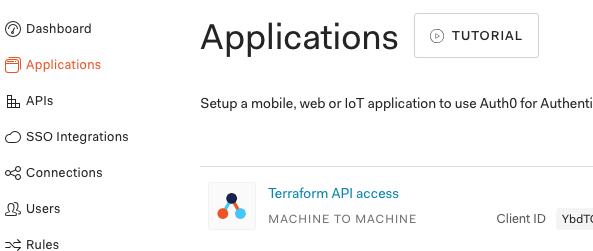

# How to create a cluster.

## Prerequisites

```

$ brew install kubernetes-cli
$ brew install kubernetes-helm
$ brew install terraform

```


## 

1. You will need to create a Tenant on https://manage.auth0.com, use your Github credentials to login and select EU region.
   No Applications (aka Clients) / Connections / Rules are needed initially, delete any defaults (Terraform cannot handle this yet)
   
   

1. A single ["Machine to Machine"](https://auth0.com/docs/applications/machine-to-machine) Application, granting it access to the Management API, all scopes. Ensure this app's "Client Secret" is kept safe as it allows the editing of authentication rules for the target app; a "rotate" option is available.
  

1. An **org-owned** [Github Oauth app](https://auth0.com/docs/connections/social/github), callback URL pointing to https://tenant-name.eu.auth0.com/login/callback

1. A "Social Connection" of type Github, using the credentials above and with read:org and read:user privs. The app can only have one instance named "github", any additional ones of the same type created via terraform or curl will not show up in the web interface.

1. Terraform and the [Yieldr Auth0 provider](https://github.com/yieldr/terraform-provider-auth0)

Steps:
1. Edit terraform.tfvars, add tenant domain, id and secret from the M2M App created above, these will be used by `provider "auth0" {}` in main.tf
1. `terraform plan && terraform apply`
1. Create a k8s cluster, see [../kops/](../kops/) folder for existing ones
   1. Copy the live-0 yaml, edit oidcClientID to match the Terraform-created app above
   1. Commit to master and check pipeline output in [CodePipeline](https://eu-west-1.console.aws.amazon.com/codepipeline/home?region=eu-west-1#/view/cluster-creation-pipeline)
   1. Use `kops export kubecfg` to get the super-admin config
1. Install Helm
    ```
      $ kubectl apply -f ../../../cluster-components/helm/rbac-config.yml
      serviceaccount "tiller" created
      clusterrolebinding.rbac.authorization.k8s.io "tiller" created
      $ helm init --tiller-namespace kube-system --service-account tiller
      ```
1. Install external-dns, see [../cluster-components/external-dns](../cluster-components/external-dns) for existing ones, copy live-0, edit domainFilters
    ```
      $ helm install -n external-dns --namespace kube-system stable/external-dns -f ../../../cluster-components/external-dns/cloud-platform-test-raz-helm-values.yaml
      $ kubectl --namespace=kube-system get pods -l "app=external-dns,release=external-dns"
      NAME                            READY     STATUS    RESTARTS   AGE
      external-dns-798cc84bdc-h4zst   1/1       Running   0          24s
    ```
1. Install ingress, see [../cluster-components/nginx-ingress](../cluster-components/nginx-ingress) for existing ones, copy live-0, edit hostname and aws-load-balancer-ssl-cert (this was generated earlier by Terraform in the pipeline triggered by the commit to master, see [../terraform/modules/cluster_ssl/](../terraform/modules/cluster_ssl/))
    ```
      $ helm install -n nginx-ingress --namespace ingress-controller stable/nginx-ingress -f ../../../cluster-components/nginx-ingress/
      $ kubectl --namespace ingress-controller get services -o wide -w nginx-ingress-controller
      NAME                       TYPE           CLUSTER-IP      EXTERNAL-IP                                                               PORT(S)                      AGE       SELECTOR
      nginx-ingress-controller   LoadBalancer   100.68.102.11   a968b3bdf851c11e886e00a458ee6675-1910441520.eu-west-1.elb.amazonaws.com   80:30967/TCP,443:31280/TCP   33s       app=nginx-ingress,component=controller,release=nginx-ingress
    ```
1. Edit config for Kuberos, see [../cluster-components/kuberos](../cluster-components/kuberos) for existing ones
    1. Copy the live-0 folder with the new name, `cd` to it
    1. Change OIDC_ISSUER_URL, OIDC_CLIENT_ID, certificate-authority-data, server, name, host in kuberos.yaml
    1. Change secret in secret.yaml (this one needs to be base64 encoded)
    1. `kubectl config current-context` - be sure you're in the one just created
    1. Install Kuberos
        ```
          $ kubectl apply -f .
          configmap "kuberos-oidc-env" created
          configmap "templates" created
          ingress.extensions "kuberos" created
          service "kuberos" created
          deployment.extensions "kuberos" created
          secret "kuberos-oidc" created

          $ kubectl -n default get pods
          NAME                      READY     STATUS    RESTARTS   AGE
          kuberos-b7d5f755d-l8jb5   1/1       Running   0          1m
        ```
1. Add WebOps group as admins
    ```
     $ kubectl apply -f ../../../cluster-config/rbac/webops-cluster-admin.yml
     clusterrolebinding.rbac.authorization.k8s.io "webops-cluster-admin" created
    ```


